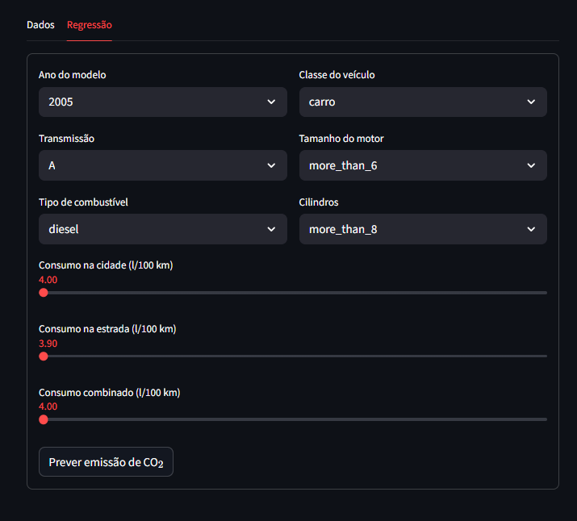

# Previsão de Emissão de $\ce{CO2}$

Através de uma base de dados retirada do Kaggle, fiz um projeto dividido em algumas etapas:
- Análise Exploratória de Dados (EDA)
- Machine Learning
- Criação de um app com streamlit

**OBS.: Como a base estava em inglês, optei por fazer a tradução da mesma durante o projeto**
**OBS.: O app foi feito na versão gratuita do streamlit, então depois de um tempo, ele entra em modo de hibernação e apenas o criador pode reativar**

**Origem dos dados:** [governocanadense](https://open.canada.ca/data/en/dataset/98f1a129-f628-4ce4-b24d-6f16bf24dd64).

**Link do app:** https://emissao-co2-asphczpzueuu3hhyvneb3j.streamlit.app/

## Um pouco sobre a base
Os conjuntos de dados fornecem classificações de consumo de combustível específicas do
modelo e emissões estimadas de dióxido de carbono para novos veículos leves para venda
no varejo no Canadá. 
O principal objetivo é prever a emissão de $\ce{CO2}$.

## Organização do projeto
- .gitignore         <- Arquivos e diretórios a serem ignorados pelo Git
- requirements.txt       <- O arquivo de requisitos para reproduzir o ambiente de análise
- LICENSE            <- Licença de código aberto (MIT)
- README.md          <- README principal para desenvolvedores que usam este projeto.
- dados              <- Arquivos de dados para o projeto.
- notebooks          <- Jupyter Notebooks.
-Apoio               <- Pasta com arquivos .py usados no projeto
  - auxiliares.py  <- Funções para ajudar na visualização de dados 
  - config.py    <- Configurações básicas do projeto
  - graficos.py  <- Funções para criação de gráficos personalizados
  - modelos.py  <- Funções para criação de modelos usados no projeto
-Imagens             <- Pasta com capturas de tela do app

## Imagem do app finalizado
